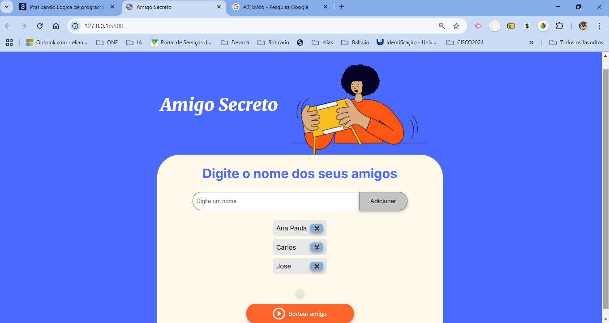
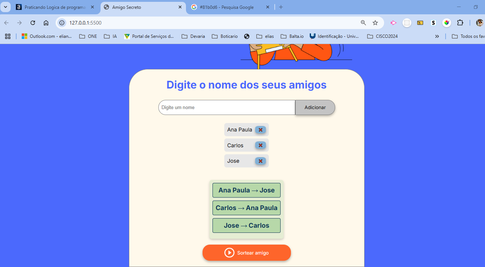

# Amigo Secreto

Este é um projeto simples de Amigo Secreto desenvolvido em HTML, CSS e JavaScript. O objetivo é permitir que usuários adicionem nomes de participantes e realizem um sorteio aleatório.

## Funcionalidades

- Adicionar nomes de participantes
- Exibir a lista de participantes
- Realizar o sorteio de amigo secreto
- Exibir os pares sorteados
- Excluir amigos

## Tecnologias Utilizadas

- HTML5
- CSS3
- JavaScript

## Como Usar

1. Abra o arquivo `index.html` no navegador.
2. Digite o nome de um participante no campo de entrada e clique no botão "Adicionar".
3. Os nomes serão exibidos em uma lista.
4. Quando todos os participantes forem adicionados, clique no botão "Sortear Amigo Secreto".
5. O resultado do sorteio será exibido na tela.

## Capturas de Tela

Aqui estão algumas imagens do projeto em funcionamento:

# Autor
Eliane Henriqueta

